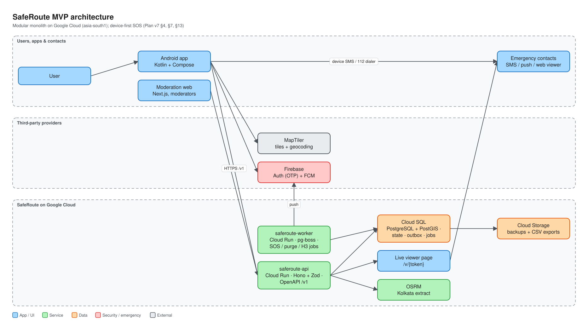
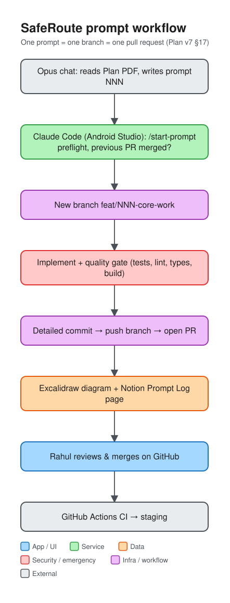

# SafeRoute Kolkata

A navigation-first Android app for Kolkata. It offers a map, search, walking/driving routes,
transparent safety context along routes, temporary live-location sharing with trusted contacts,
and a **device-first SOS** that reaches emergency contacts even when the server or mobile data is
unavailable.

> SafeRoute is not an emergency service. Every SOS surface offers a one-tap call to **112**.
> Safety information is context, never a guarantee that a route or area is safe.

The design, product and technical plan is in
[`docs/plan/SafeRoute_Plan_v7_MVP.pdf`](docs/plan/SafeRoute_Plan_v7_MVP.pdf) (Plan v7).



## Stack

- **Android:** Kotlin, Jetpack Compose, Material 3, Hilt, Room, WorkManager, MapLibre, Firebase
  Auth/FCM ([ADR 0001](docs/adr/0001-kotlin-native-openapi.md))
- **Backend:** TypeScript modular monolith, Hono + Zod → OpenAPI 3.1, PostgreSQL + PostGIS,
  pg-boss, on Google Cloud Run (asia-south1)
- **Contract:** `contracts/openapi.json` generated from the backend; the Kotlin client is generated
  from it

## Repository map

| Path | Purpose | Filled by |
| --- | --- | --- |
| [`android/`](android/) | Kotlin + Compose app | P007–P016 |
| [`backend/`](backend/) | Hono API + pg-boss worker | P002–P006, P012–P021 |
| [`moderation/`](moderation/) | Moderator web app | P018 |
| [`contracts/`](contracts/) | Generated `openapi.json` | P004 |
| [`infra/`](infra/) | GCP / Cloud Run / WIF config | P006, P012, P020 |
| [`tools/diagrams/`](tools/diagrams/) | JSON → Excalidraw/SVG/PNG diagram generator | P001 |
| [`docs/plan/`](docs/plan/) | Plan v7 PDF | P001 |
| [`docs/adr/`](docs/adr/) | Architecture Decision Records | any prompt |
| [`docs/diagrams/`](docs/diagrams/) | Diagram specs + exports | any prompt |
| [`docs/prompt-logs/`](docs/prompt-logs/) | One log per prompt | every prompt |
| [`docs/runbooks/`](docs/runbooks/) | Operational runbooks | P006, P020–P022 |
| [`CLAUDE.md`](CLAUDE.md) | Rules Claude Code follows (golden rules, conventions, quality gate) | P001 |

## How the workflow runs



1. An Opus chat reads the plan and writes the next prompt from the catalog (Plan v7 §18).
2. Rahul pastes it into Claude Code in Android Studio's terminal at the repo root.
3. Claude Code runs **`/start-prompt`**: syncs `main`, checks that the previous PR is merged,
   updates Notion, and creates the branch `<type>/<NNN>-<core-work>`.
4. Claude Code implements only the prompt's scope and runs the quality gate.
5. Claude Code runs **`/ship-prompt`**: diagram (if required), prompt log, detailed commit, pushes
   the branch, opens a PR, and completes the Notion Prompt Log page.
6. **Rahul reviews and squash-merges on GitHub.** Claude Code never pushes to `main` and never
   merges.

Only P001 (this bootstrap) committed directly to `main`. After it, `main` is protected by
`CLAUDE.md` rules, Claude Code deny rules, a local pre-push hook, and a GitHub ruleset where
available.

### One-time local setup after cloning

```sh
git config core.hooksPath .githooks     # enable the pre-push hook that rejects pushes to main
git config commit.template .gitmessage  # optional: commit message template
```

## Package name

The Android package name / application ID is **chosen once and never changed after publishing**
(Plan v7 §15.1). It is decided in P007. `in.saferoute.app` is only a suggestion until Rahul
confirms it.

## Documentation

- Notion: **SafeRoute Kolkata — Engineering** (Prompt Log, Architecture Decisions, Follow-ups,
  Runbooks)
- Repo: `docs/prompt-logs/` mirrors every Notion prompt page
