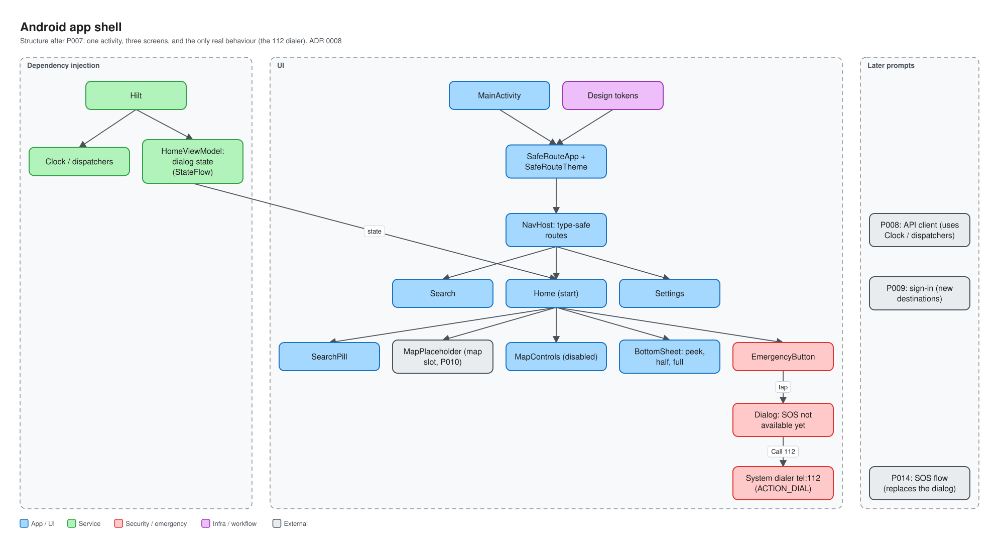
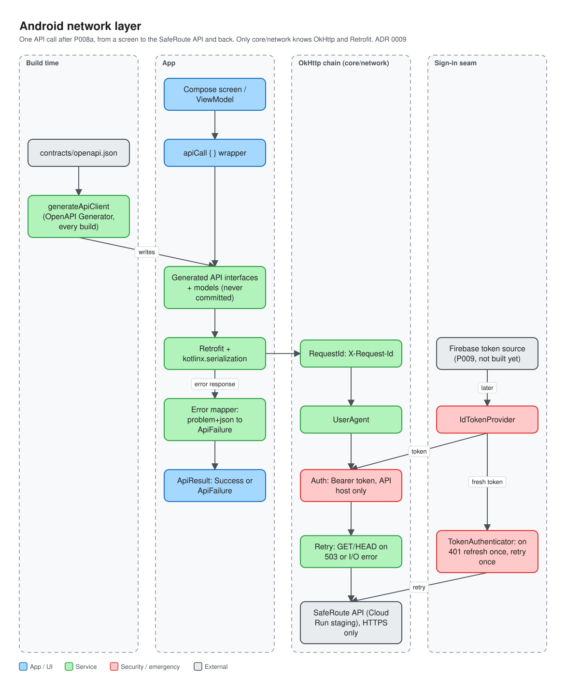
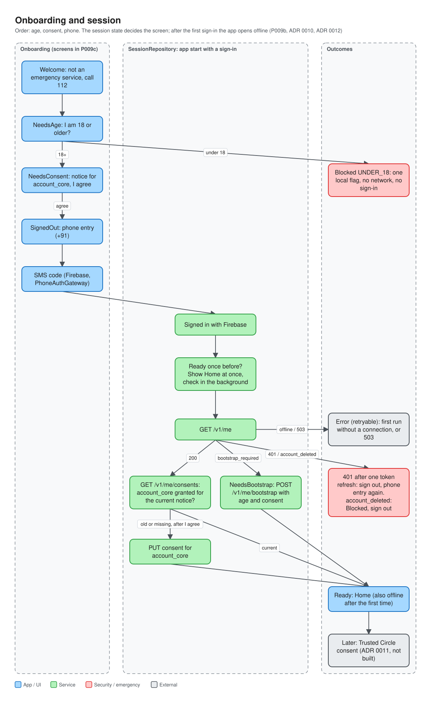

# android/

The native Android app for SafeRoute: Kotlin, Jetpack Compose, Material 3 and Hilt
(Plan v7 §5). Decisions and their reasons are in
[ADR 0008](../docs/adr/0008-android-foundation.md) and
[ADR 0009](../docs/adr/0009-android-api-client.md).

**Status (P007):** the app shell. Home shows a placeholder where the map will be, a search pill,
two map buttons (disabled), a bottom sheet and the emergency button; Search and Settings are
reachable from it. The only real behaviour is the emergency button: a dialog that can open the
phone dialer with 112. The map arrives with P010, sign-in with P009, SOS with P014.

**Status (P008a):** the app can talk to the backend: a generated API client and the network
layer around it (see [Talking to the backend](#talking-to-the-backend)).

**Status (P008b):** debug builds have *Settings → Developer*, a server check that uses that
client. Release builds don't contain it.



## Open it in Android Studio

1. *File → Open* and pick the **`android`** folder (not the repository root). Android Studio
   treats that folder as the Gradle project.
2. Wait for "Gradle sync" to finish (bottom status bar). The first sync downloads the libraries
   and a JDK 17, so it needs a network connection and a few minutes.
3. The file `local.properties` that Android Studio creates holds the path of your Android SDK.
   It is ignored by git and must never be committed.
4. The build needs `app/google-services.json` (the Firebase configuration). See
   [Signing in](#signing-in) for where the real file goes, or how to write a dummy one.

## Run it on a phone

1. On the phone: *Settings → About phone*, tap *Build number* seven times, then switch on
   *Developer options → USB debugging*.
2. Connect the phone by USB and accept the "Allow USB debugging" prompt.
3. In Android Studio pick the phone in the device menu (top toolbar) and press **Run** (the
   green triangle). The run configuration is called `app`.

## Run the quality gate from a terminal

In the `android` folder. Android Studio's terminal (*View → Tool Windows → Terminal*) opens
at the right place if you opened the `android` folder.

```sh
./gradlew lint testDebugUnitTest assembleDebug
```

On Windows PowerShell write `.\gradlew` instead of `./gradlew`.

- `lint` checks the code and resources for Android-specific mistakes. Errors fail the build;
  warnings don't. Report: `app/build/reports/lint-results-debug.html`.
- `testDebugUnitTest` runs the tests on your computer (no phone needed). Report:
  `app/build/reports/tests/testDebugUnitTest/index.html`.
- `assembleDebug` builds the debug APK: `app/build/outputs/apk/debug/app-debug.apk`.

One test: `./gradlew testDebugUnitTest --tests "*ThemeContrastTest"`.

If Gradle can't find Java, point it at the JDK that ships with Android Studio **for this
terminal session only** (don't set it system-wide). In PowerShell, with the default install
location:

```powershell
$env:JAVA_HOME = "C:\Program Files\Android\Android Studio\jbr"
```

CI runs the same command: [`.github/workflows/android-ci.yml`](../.github/workflows/android-ci.yml).
It also runs when `contracts/` changes, builds the release variant with the dummy address
`https://example.invalid/`, checks that a release without `saferoute.apiBaseUrl` fails, and
checks that the release APK has none of the debug-only code. Since P009b it first writes a
dummy `google-services.json`, and proves that a release build refuses that dummy file and a
missing one (see [Signing in](#signing-in)).

## Project structure

One Gradle module (`:app`), packages by feature (Plan v7 §5.2):

```text
android/
  gradle/libs.versions.toml        every version, in one place
  gradle/gradle-daemon-jvm.properties   which JDK runs Gradle itself (25)
  app/build.gradle.kts             the app module's build
  app/src/main/
    AndroidManifest.xml            app entry points; permissions: INTERNET and fine/coarse
                                   location (foreground only); the Firebase libraries merge
                                   in two more (ADR 0012); the Wi-Fi one the map library
                                   would add is removed (ADR 0015)
    java/com/saferoute/app/
      SafeRouteApplication.kt      process entry point (@HiltAndroidApp)
      MainActivity.kt              the single activity
      SafeRouteApp.kt              root composable: background + navigation host
      navigation/                  destinations (type-safe routes) and the NavHost
      feature/home/                Home screen, HomeViewModel, map status card and credit,
                                   location permission flow and "my location", 112 dialog
      feature/search/              Search screen (layout only until P011)
      feature/directions/          routes to a chosen place: repository, states, sheet (P012c1)
      feature/settings/            Settings: account, privacy, About
      feature/onboarding/          welcome, age gate, consent notice, phone and code, blocked
      core/designsystem/theme/     colours, type, shapes, spacing: the design tokens
      core/designsystem/component/ SearchPill, MapControlButton, EmergencyButton, sheet
      core/designsystem/preview/   @SafeRoutePreviews (light, dark, Bengali, 200% font)
      core/di/                     Hilt module: Clock and coroutine dispatchers
      core/network/                HTTP client, token seam, retries, error mapping (ADR 0009)
      core/auth/                   phone sign-in behind PhoneAuthGateway; the only Firebase code
      core/location/               LocationRepository; FusedLocation.kt is the only file that
                                   uses Google's location library (ADR 0015)
      core/map/                    the map behind MapEngine/MapController; MapLibreEngine.kt is
                                   the only file that uses MapLibre (ADR 0015)
      core/session/                session state machine and the stored onboarding flags
    res/values/strings.xml         English text
    res/values-bn/strings.xml      Bengali text
    res/xml/locales_config.xml     languages offered by the system per-app language picker
    res/xml/network_security_config.xml   HTTPS only, system certificates only
  app/google-services.json         Firebase configuration (not in git; real or dummy)
  scripts/write-dummy-google-services   writes the dummy Firebase configuration
  app/build/generated/openapi/     the generated API client (not in git, never edited)
  app/src/debug/                   debug builds only: the developer server check and its strings
  app/src/release/                 release builds only: no-op stand-ins for the debug hooks
  app/src/test/                    tests that run on the JVM (JUnit, Robolectric)
  app/src/testDebug/               tests for the debug-only code
```

Packages for later features (`data/`, `service/`, `work/`, more `feature/…`) are created by the
prompt that needs them.

How a screen is put together (see `feature/home`):

- `HomeScreen` is plain UI: it takes values and callbacks, knows nothing about Hilt or
  navigation, and can be previewed and tested alone.
- `HomeRoute` connects it to `HomeViewModel`, which holds the state as a `StateFlow`.
- `navigation/SafeRouteNavHost.kt` is the only place that knows which screen leads where.
- Features depend on `core`; `core` never depends on a feature.

## Versions

Chosen on 2026-10-02 from Google Maven and Maven Central metadata; all are stable releases.

| What | Version | Note |
| --- | --- | --- |
| Gradle | 9.6.0 | wrapper, as created by the wizard |
| Android Gradle Plugin | 9.4.1 | Kotlin support is built in |
| Kotlin and Compose compiler plugin | 2.4.20 | |
| KSP | 2.3.12 | runs Hilt's code generator (no kapt) |
| Hilt (Dagger) | 2.60.1 | |
| Compose BOM | 2026.09.00 | Compose UI 1.12.1, Material 3 1.4.0, icons core 1.7.8 |
| Activity Compose | 1.13.0 | |
| Navigation Compose | 2.10.2 | type-safe routes |
| Lifecycle (runtime-compose, viewmodel-compose) | 2.11.0 | |
| Hilt ViewModel for Compose (`hilt-lifecycle-viewmodel-compose`) | 1.4.0 | provides `hiltViewModel()` |
| kotlinx.serialization (core) | 1.11.0 | makes routes `@Serializable`; plugin version = Kotlin |
| Core SplashScreen | 1.2.0 | |
| kotlinx.coroutines | 1.11.0 | |
| OkHttp | 5.5.0 | HTTP client (chosen 2026-10-03) |
| Retrofit and its kotlinx.serialization converter | 3.0.0 | turns the generated interfaces into calls |
| kotlinx.serialization (JSON) | 1.11.0 | |
| OpenAPI Generator (Gradle plugin `org.openapi.generator`) | 7.25.0 | build time only; writes the API client |
| Firebase BoM | 34.19.0 | picks firebase-auth 24.2.0 (chosen 2026-10-06) |
| Google Services Gradle plugin | 4.5.0 | build time only; reads `google-services.json` |
| DataStore Preferences | 1.2.1 | the stored onboarding flags |
| kotlinx-coroutines-play-services | 1.11.0 | `await()` for Play services tasks |
| OkHttp MockWebServer | 5.5.0 | tests only |
| JUnit 4 · Robolectric · AndroidX Test · Turbine | 4.13.2 · 4.17 · core 1.7.0, ext-junit 1.3.0 · 1.2.1 | tests only |
| compileSdk · targetSdk · minSdk | 37 · 36 · 26 | see ADR 0008 for why compileSdk is not 36 |
| JDK | 17 to compile and test; 25 to run Gradle | Gradle downloads 17 if it is missing |

To change a version, edit `gradle/libs.versions.toml` only.

## Talking to the backend

The app never contains hand-written request or response classes. They are generated from the
contract, [`contracts/openapi.json`](../contracts/openapi.json), every time the app is built
([ADR 0009](../docs/adr/0009-android-api-client.md)).



**Generation.** The Gradle task `generateApiClient` runs before the Kotlin compiler. It writes
Retrofit interfaces (`OperationalApi`, `MeApi`) and data classes (`Health`, `Me`,
`ProblemDetails`, ...) to `app/build/generated/openapi`, package
`com.saferoute.app.core.network.generated`. When the contract changes, the next build
regenerates them; if the change breaks the app's code, the build fails. To regenerate by hand:

```sh
./gradlew generateApiClient
```

**Where the server address comes from.** From the Gradle property `saferoute.apiBaseUrl`. It
is not in the repository. Put it in your **user-level** Gradle properties file, which lives in
your home folder, outside every project (`<home>/.gradle/gradle.properties`; create the file if
it does not exist):

```properties
saferoute.apiBaseUrl=https://<your staging host>/
```

It must start with `https://` and end with `/`; anything else stops the build with a message.
Then run *File → Sync Project with Gradle Files* in Android Studio.

- Without the property a debug build uses the placeholder `https://api.invalid/`, an address
  that exists nowhere. The app then knows that no server is configured.
- A **release** build without the property fails (`checkReleaseApiBaseUrl`), so a release can
  never point at the placeholder. To build one locally:
  `./gradlew assembleRelease -Psaferoute.apiBaseUrl=https://<host>/`.

**Using the client** (from a repository class, not from a screen):

```kotlin
when (val result = apiCall { operationalApi.getHealth() }) {
    is ApiResult.Success -> result.value.version
    is ApiResult.Failure -> result.failure   // Problem, Unauthorized, NoConnection, Unexpected
}
```

**Checking the connection on a phone (debug builds only).** *Settings → Developer* opens the
server check. It calls `GET /health` and `GET /health/ready` through the real client and shows:
whether a server is configured, the health status with the backend's version, the readiness
status, and the last request id. Each failure has its own message ("Cannot reach the server",
"Server unavailable, try again", ...). It never shows the address or a token.

How it stays out of release builds: the screen, its ViewModel, `ServerCheck` and their strings
are in `app/src/debug`. `navigation/SafeRouteNavHost.kt` calls two hooks,
`developerDestinations()` and `DeveloperSettingsEntry()`; `src/debug` defines them with the
screen, `src/release` defines them as empty. `DeveloperToolsLayoutTest` checks that nothing in
`src/main` or `src/release` refers to the debug code, and CI scans the release APK for it.

**Finding a request in the backend's logs.** Every request carries an `X-Request-Id`. A debug
build writes one line per request to Logcat under the tag `SafeRouteHttp` (method, path, status,
duration, request id; never a header, a body or a query string); the server check screen shows
the last one. Search Cloud Logging for that id as described in
[`docs/runbooks/observability-staging.md`](../docs/runbooks/observability-staging.md).

**What not to do:**

- Never edit or commit anything under `app/build/generated`. Change the backend's contract.
- Never write a request or response class by hand.
- Never put the server address in a tracked file, a test, a log, a screenshot or a pull request.
- Never send the ID token to any server but the API, and never log a request or response body.
- Never add an exception to `network_security_config.xml` (no cleartext, no user certificates).

## Signing in

Users sign in with a phone number and an SMS code through Firebase Authentication
([ADR 0012](../docs/adr/0012-firebase-config-in-builds.md)). The order is fixed: **age → consent
→ phone**. Nothing is sent to any server before the user has said "I am 18 or older" and
accepted the consent notice ([ADR 0010](../docs/adr/0010-adults-only-and-consent-records.md)).



**The screens (since P009c).** Welcome → "How old are you?" → the consent notice → mobile
number → SMS code → Home. Home cannot be reached before all of them are done.

- **Age.** "I am under 18" asks for confirmation and then blocks the app on that phone. There
  is no undo in the app; clearing the app's storage or reinstalling asks the question again
  (ADR 0010, addendum).
- **Consent notice.** English or Bengali, switchable on that screen only. "I agree" becomes
  available once the notice has been scrolled to its end. The text is a **draft**; debug
  builds say so on the screen. It is mirrored in
  [`docs/legal/consent-notice-v1.md`](../docs/legal/consent-notice-v1.md), and a test fails if
  the two differ. Changing the text means changing `NOTICE_VERSION`.
- **Phone and code.** `+91` is fixed. A new code can be requested after 60 seconds. If Android
  kills the app on the code screen, you come back to the phone screen.
- **Settings → Account** shows the masked phone number (`+91 ••••• ••123`), "Sign out" (asks
  first, then returns to the start) and the consents on record.
- **Settings → Developer** (debug builds) also shows the session state and "Who am I": the
  role and language the server has for you. It proves the phone's ID token is accepted.

### Try it on a phone with a Firebase test number

1. Have the real `google-services.json` in place and `saferoute.apiBaseUrl` set (see above and
   "Talking to the backend").
2. In the Firebase console, add a **test phone number** with a fixed code (*Authentication →
   Sign-in method → Phone → Phone numbers for testing*). No SMS is sent and nothing is charged.
3. Run the debug app, go through the screens, type the test number without `+91`, then its
   code.
4. *Settings → Developer → Ask the server who I am* should answer with role `user`.

Type the test number and code on the phone only. Don't put them in the repository, in Notion,
in a chat or in a screenshot.

### The Firebase configuration file

The build needs `android/app/google-services.json`. It is **never in the repository**.

- **You have the real file** (downloaded from the Firebase console for the staging project):
  put it at `android/app/google-services.json`. Git ignores it. Check with
  `git check-ignore android/app/google-services.json`, which must print the path. Never commit
  it, paste it anywhere, or screenshot it.
- **You don't** (a fresh clone, CI): write a dummy one.

  ```sh
  android/scripts/write-dummy-google-services
  ```

  It creates the file with fake values (project `demo-saferoute`) and never overwrites an
  existing file. With it the app builds and every test passes, but sign-in cannot work. On
  Windows run it from Git Bash, or with `sh android/scripts/write-dummy-google-services`.

Without either, Gradle stops with an error from the Google Services plugin.

**Release builds** refuse the dummy file and a missing file (`checkReleaseFirebaseConfig`). CI
passes `-Psaferoute.allowDummyFirebase=true` for the one release build it makes to check that
a release still assembles; never use that flag for a build that goes to a phone.

### Firebase console settings sign-in depends on

- The Android app `com.saferoute.app` is registered in the project.
- The **SHA-1 and SHA-256 fingerprints** of the key that signs the build are added to that app.
  Firebase uses them to check that a sign-in request comes from the real app. For debug builds
  that is your debug keystore (*Gradle → app → Tasks → android → signingReport* in Android
  Studio). A release key's fingerprints come with P022.
- *Authentication → Sign-in method → Phone* is enabled, and the SMS region policy allows India.
- **Test phone numbers** (*Phone → Phone numbers for testing*): a number and a fixed 6-digit
  code that work without an SMS being sent, cost nothing and don't count against quotas. Use
  one for development. The numbers and codes live in the console only: never in the
  repository, in Notion, in a chat or in a screenshot.

### How the code is organised

| Piece | Where | What it does |
| --- | --- | --- |
| `PhoneAuthGateway` | `core/auth` | Sign-in as the app sees it: start verification, verify code, resend, sign out, ID token. The only door to Firebase |
| `FirebasePhoneAuthGateway` | `core/auth` | The implementation on the Firebase SDK. Thin; checked on a phone |
| `FirebaseIdTokenProvider` | `core/auth` | Gives the network layer the ID token (the seam from "Talking to the backend") |
| `normaliseIndianMobile` | `core/auth` | Turns typed input into `+91` and ten digits, or rejects it |
| `Session` / `SessionRepository` | `core/session` | Decides the `SessionState` from the stored flags, Firebase and the API. Screens use the `Session` interface |
| `OnboardingNavHost` | `navigation` | Shows the onboarding screen that belongs to the session state |
| Welcome, age, notice, phone, code, blocked screens | `feature/onboarding` | Plain UI plus `OnboardingViewModel` and `SignInViewModel` |
| `SessionStore` | `core/session` | Six flags in Jetpack DataStore; never the phone number, a token or a code |

The session states: `Loading`, `NeedsAge`, `NeedsConsent`, `SignedOut`, `NeedsBootstrap`,
`Ready`, `Blocked(UNDER_18 | ACCOUNT_DELETED)`, `Error(retryable)`.

**Who runs the session check.** `SessionRepository` runs every state change in a scope that
lives as long as the app, and callers only wait for the result. A screen's `viewModelScope` is
cancelled when the screen is replaced, and a session state change is exactly what replaces the
screen: work started there would be cut off half-way (that was the "stuck on One moment…" bug
fixed in P009d). A check that takes longer than 60 seconds, or fails unexpectedly, ends in the
"Something went wrong" screen with "Try again", never in an endless spinner. After creating an
account the app reads the account and its consents back before it shows Home.

**Opening without a connection.** Once the app has been `Ready` with a sign-in, it shows Home
at once on the next start and checks with the server in the background. Only a definite answer
(the sign-in is no longer valid, the account was deleted, the consent is out of date) takes the
user out of Home. A first run needs a connection.

**In tests** nothing talks to Firebase or the server. A test that starts the real activity
replaces the session with `FakeSession` (ready, so the app's own screens show):

```kotlin
@HiltAndroidTest
@UninstallModules(SessionBindingModule::class)
class MyTest {
    @BindValue @JvmField val session: Session = FakeSession(SessionState.Ready)
}
```

A test that goes through sign-in also replaces `AuthModule` with `FakePhoneAuthGateway`
(see `OnboardingNavigationTest`).

**What not to do:**

- Never log, store or put in a test a real phone number, an ID token, an SMS code or a
  Firebase user id. Tests use the `FAKE_...` values next to `FakePhoneAuthGateway`.
- Never call the Firebase SDK outside `core/auth`.
- Never ask for the phone number before the age declaration and the consent notice.
- Never add Analytics, Crashlytics or another Firebase product without a prompt that asks for
  it.

## Map and MapTiler

The map is drawn by [MapLibre Native](https://github.com/maplibre/maplibre-native) (open
source) with styles and tiles from [MapTiler](https://www.maptiler.com/), built on
OpenStreetMap data. Decisions and their reasons:
[ADR 0015](../docs/adr/0015-map-stack-and-location-policy.md).

### Get a key and tell the build

1. Sign in at <https://cloud.maptiler.com/>, open **Account → API keys** and create a key for
   development (keep a separate one for production later).
2. Add one line to your **user-level** `gradle.properties` (the same file that holds
   `saferoute.apiBaseUrl`; on Windows it is in the `.gradle` folder of your user profile):

   ```properties
   saferoute.mapTilerKey=<your key>
   ```

3. Sync Gradle and run the app.

The key is never written in a tracked file, never printed by the build and never shown or
logged by the app. Do not paste it into an issue, a pull request, a prompt log or a chat.

### Restrict the key (do this once, in the MapTiler dashboard)

A key that ships inside an app can be read by anyone who unpacks the APK. It is protected by
what the dashboard allows it to do, not by hiding it:

- **Allowed user-agent header:** enter `com.saferoute.app`. MapLibre sends the app's package
  name in its `User-Agent`, so requests from other software are refused. (This is a string
  check and can be imitated; it stops casual reuse.)
- **Usage alert and limit:** set an alert well below the plan's monthly limit, so that a leak
  or a bug is noticed before the map stops for everyone.
- **If the key leaks or is abused:** delete it in the dashboard, create a new one, put the new
  one in `gradle.properties`.

Tile requests are the main cost of running the app (Plan v7 §14.1). Watch the request count in
the MapTiler dashboard; there is nothing in the app that reports it.

### What the map area can show

| What you see | State | Meaning |
| --- | --- | --- |
| The map | Ready | Also when offline, as long as the area was viewed before (it comes from the cache) |
| "Loading map…" | Loading | The style is being fetched. Ends within 20 seconds at the latest |
| "The map couldn't load" + Try again | Error | The request failed for a reason a retry may fix |
| "Map unavailable offline" + Try again | Offline | No connection and nothing cached. Recovers by itself when the connection returns |
| "Map temporarily unavailable" + Try again | RateLimited | MapTiler refused the key (wrong, restricted) or the plan's quota is used up |
| "Map not configured" | NotConfigured | This build has no `saferoute.mapTilerKey` |

In every state the search pill, the map controls, the bottom sheet and the emergency button
work as usual: they are separate from the map.

### Run without a key

Just build: without the property the app shows "Map not configured" and everything else works.
CI builds this way. A **release** build refuses to assemble without a real key
(`checkReleaseMapKey`); CI's release check passes an obviously fake key together with
`-Psaferoute.allowDummyMapKey=true`, which nobody else should use.

### How the code is organised

- `core/map/MapTypes.kt`: the map vocabulary of the app (`LatLng`, `CameraState`,
  `MapLoadState`, overlay descriptions, `MapController`). Plain Kotlin.
- `core/map/MapProviderConfig.kt`: everything MapTiler-specific (style names, URL, credit
  links, cache size) and `RegionDefaults`, where the map opens.
- `core/map/MapStateHolder.kt`: the state machine. It survives rotation in `HomeViewModel`;
  the map view does not, and re-attaches to it.
- `core/map/MapLibreEngine.kt`: **the only file that imports MapLibre.**
  `MapLibreBoundaryTest` fails if another file does. Tests never load the native library:
  Hilt tests get `FakeMapEngine` (`src/test/.../core/map/FakeMap.kt`).
- The camera position is saved in the ViewModel's `SavedStateHandle`, so the map reopens where
  you left it after a rotation or after Android reclaimed the app's memory.

## Location

The map can show where you are. Policy and reasons:
[ADR 0015](../docs/adr/0015-map-stack-and-location-policy.md), "Location policy". Flow:
[`docs/diagrams/010-location-permission-flow.svg`](../docs/diagrams/010-location-permission-flow.svg).

- **Foreground only.** Location runs while Home is visible and stops when it is not. There is
  no background location and no foreground service.
- **Nothing leaves the phone.** The position is drawn on the map and kept in memory. It is not
  saved, logged or sent to the SafeRoute API.
- **Nothing is asked until the user taps "my location".** The app's explanation comes first,
  Android's dialog second.

### Permission states

| State | When | What the user sees |
| --- | --- | --- |
| NotAsked | fresh install, or after "Only this time" expired | the plain "my location" button |
| DisclosureShown | after a tap | the app's explanation: Continue / Not now |
| Granted (precise) | "Precise" + "While using the app" | blue dot, accuracy circle, arrow while moving |
| Granted (approximate) | "Approximate" | a ring and a wide circle; a hint with "Use precise location" (offered once) |
| DeniedOnce / RationaleNeeded | refused once | a short note; the button still works and explains again |
| DeniedPermanently | refused twice, or "Don't allow" in Settings | a note with "Open Settings" (the app's page) |
| ServicesOff | the phone's Location switch is off | a note with "Location settings" |
| PlayServicesUnavailable | no Google Play services | a note; the map and the emergency button work |

The state is read from Android again every time Home resumes, so changing a permission in
system Settings while the app is in the background takes effect on return.

The button itself: plain (off), spinner (searching), crosshair (located: a tap centres the
map, a second tap follows you), arrowhead in the accent colour (following: a tap stops),
crossed ring (unavailable: a tap says why). Each state has its own TalkBack description.

### Test it on a phone

1. Tap "my location": the explanation appears. "Not now" closes it and nothing was asked.
2. Tap again, "Continue", then "While using the app" with "Precise": dot and circle appear and
   the map centres on you. Tap the button to centre, tap again to follow, drag the map to stop.
3. **Revoke or change:** system Settings → Apps → SafeRoute → Permissions → Location. Choose
   "Don't allow", or switch off "Use precise location", and return to the app.
4. **Location off:** switch off Location in quick settings and return to the app.
5. **Background:** press Home. The location indicator in the status bar goes away.
6. **Start over:** Settings → Apps → SafeRoute → Storage → Clear storage (this also signs you
   out), or `adb shell pm reset-permissions`.

### Test with mock locations

- **Emulator:** the "…" button → Location: set a point or play a route. The emulator image
  must include Google Play services ("Google Play" or "Google APIs" images).
- **Phone:** enable Developer options, choose a mock-location app under "Select mock location
  app", and set a position in that app.

The debug Developer screen (Settings → Developer) has a "Location" row that shows the
permission, whether the phone's Location is on, and how old the last fix is, in words and
buckets (`Precise · on · fix <10 s`). It never shows coordinates.

### How the code is organised

- `core/location/LocationRepository.kt`: `LocationState` (NoPermission, Searching, Fix, Stale,
  Unavailable) and `DefaultLocationRepository`, the one source of the phone's position (the
  map now, SOS in P014). Tested with virtual time and a fake phone.
- `core/location/FusedLocation.kt`: **the only file that uses Google's location library**
  (`MapLibreBoundaryTest` checks it). Not run in JVM tests.
- `feature/home/LocationPermissionViewModel.kt`: the permission state machine.
- `feature/home/MyLocation.kt`: the button, the explanation, the notices, and what is drawn
  for each location state. `core/map/MapOverlayGeoJson.kt` turns that into shapes.
- Hilt tests get `FakeLocationRepository` and `FakeLocationEnvironment` automatically
  (`FakeLocationModule`).

## Search

Place search (since P011b, [ADR 0018](../docs/adr/0018-search-and-geocoding.md)).

**The flow.** The search pill on Home opens the search screen. Typing waits 300 ms after the
last keystroke and then searches (at least two characters); the keyboard's Search key searches
at once. Tapping a result returns to Home: the map moves to the place, a pin marks it, and the
sheet shows a card with its name. The card's close button, or the back gesture, removes the pin
and the card; the next back is the normal one.

**What is sent, and to whom.**

| Sent to the SafeRoute API | Not sent |
| --- | --- |
| The text you typed | Your own position (search needs no location permission and asks for none) |
| The centre of the map, rounded to two decimals (about 1 km) | The exact map position, your phone number, your contacts |
| The app language (`en` or `bn`) | Anything to the geocoding provider directly: the app never talks to it |

The SafeRoute API forwards the text and the coarse area to the geocoding provider (Geoapify)
with its own server key. The provider sees SafeRoute's server, not your phone. There is no
geocoding key in the app.

**What is not stored.** Nothing. The typed text lives in the screen's saved state, so it
survives a rotation, and is gone when the screen closes. There are no recent searches and no
saved places. The chosen place is kept in memory (and in Android's saved state, so that it
survives the system stopping the app) until you close its card. Queries, results and positions
are never logged; the types that hold them print "hidden".

**Where the code is.**

| File | What |
| --- | --- |
| `feature/search/SearchRepository.kt` | `SearchRepository`; `ApiSearchRepository` calls the generated `SearchApi` through `apiCall { }`. The search is sent as a POST body, never in the URL: servers and platforms log URLs ([ADR 0019](../docs/adr/0019-privacy-in-urls.md)) |
| `feature/search/SearchViewModel.kt` | Debounce, "only the newest answer counts", the screen's states |
| `feature/search/SearchScreen.kt` | `SearchRoute` (with the ViewModel) and the stateless `SearchScreen` |
| `core/map/MapSelection.kt` | What Search and Home share: the chosen place and the map's centre |
| `feature/home/PlaceCard.kt` | The card in the sheet |

- Tests use `FakeSearchRepository`; `FakeSearchModule` replaces the real one in every Hilt
  test, so no test calls a server.
- The pin is an overlay description (`MapOverlay.Marker` with `MarkerStyle.Place`); only
  `core/map/MapLibreEngine.kt` turns it into a map layer.
- The credit line under the results comes from the API (`attribution`) and must stay visible
  whenever results are shown.
- `debounce` and `flatMapLatest` are experimental coroutine APIs and are not used;
  `collectLatest` with a `delay` does both jobs with stable APIs.

**Not built yet:** directions (the card's button is disabled until P012), recent searches and
saved places (they need a consent purpose and a retention rule first), the attribution as a
link.

## Directions

Routes from your position to a chosen place (since P012c1,
[ADR 0020](../docs/adr/0020-routing-osrm.md);
[flow](../docs/diagrams/012c-directions-flow.svg)).

**The flow.** The place card has a Directions button. The first time ever, a short note says
what is sent; after "Continue" the app asks the SafeRoute API for routes from where the
location dot is to the place. The sheet rises and shows up to three cards (time, distance, and
"Fastest" on the first) with the map credit; the routes are drawn on the map, the chosen one
strong and the others grey, and the map shows the chosen one whole. Tapping a card chooses
another route. Walking or driving is a toggle, and the app remembers the choice. Back closes
directions first, then the place.

**When there are no routes.** Each reason has its own sentence: routes aren't available here
yet (outside the covered area), no route found, a place not near a road, too far for this way
of travelling, too many requests, offline, temporarily unavailable.

**"Starting the routing service".** The routing service on the server sleeps when nobody uses
it. The first request after a quiet time can be slow, or be answered "ask again in N seconds".
The app then says "Starting the routing service, this can take a moment", waits (at most 15
seconds at a time) and asks again by itself at most twice. After that it stops and shows a Try
again button. A spinner never runs for ever.

**What is sent, and to whom.**

| Sent to the SafeRoute API | Not sent |
| --- | --- |
| Your position when you ask (the start), to six decimals | Anything before you continued past the note; anything while directions are closed |
| The chosen place's position (the destination) | The place's name, your phone number, your contacts |
| Walking or driving | Anything to a routing or map provider directly: the app talks to the SafeRoute API only |

**What is stored.** On the phone: the walking/driving choice and "the note was read", in the
app's DataStore file. Nothing else: no origin, destination, route or history, on the phone or
on the server. Routes live in memory until directions are closed, and are never logged; the
types that hold them print "hidden".

**What it deliberately does not do.** No label, colour or score about safety, risk or traffic
on a route: a card is a time, a distance and "Fastest". No automatic rerouting. No turn-by-turn
instructions. Following the route as you move, choosing a route by tapping the map and choosing
another start arrive with P012c2.

**Where the code is.**

| File | What |
| --- | --- |
| `feature/directions/RouteRepository.kt` | `RouteRepository`; `ApiRouteRepository` calls the generated `RoutingApi` through `apiCall { }` (a POST body, never a URL) and maps every problem code |
| `feature/directions/Polyline6.kt` | Decodes the route line the server sends; runs off the main thread |
| `feature/directions/DirectionsViewModel.kt` | The states, one request at a time, the bounded wait |
| `feature/directions/DirectionsSheet.kt` | The panel in Home's sheet and the one-time note |
| `feature/directions/RoutePreferences.kt` | The two remembered settings |
| `core/map/RouteDisplay.kt` | What Directions and Home share: the routes to draw. Home draws them as `MapOverlay.Route`; MapLibre types stay in `MapLibreEngine.kt` |

- Tests use `FakeRouteRepository` and `FakeRoutePreferences`; `FakeDirectionsModule` replaces
  the real ones in every Hilt test, so no test asks a server for a route.
- Not checked without a phone: how the route lines, their light edge and the start ring look
  on the real map; the camera fit with the sheet half open; TalkBack reading the cards.

## Design tokens

Everything visual comes from `core/designsystem/theme/`:

| File | Holds | Read it with |
| --- | --- | --- |
| `Color.kt` | Material 3 light and dark colour schemes | `MaterialTheme.colorScheme.primary` |
| `SafeRouteColors.kt` | meaning-bearing colours: `sos`, `caution`, `positive`, `mapOverlay`, `scrim` | `SafeRouteTheme.colors.sos` |
| `Type.kt` | the type scale (system fonts) | `MaterialTheme.typography.bodyLarge` |
| `Shape.kt` | corner shapes; pill and sheet shapes | `MaterialTheme.shapes.medium`, `SafeRouteShapeTokens.Pill` |
| `Dimens.kt` | spacing (4/8/12/16/24/32 dp), elevation, the 48 dp touch target | `SafeRouteTheme.spacing.md` |

Rules: don't write colour or dp literals in screens; the `sos` red is only for the emergency
button and dialog; after changing a colour run `ThemeContrastTest`, which checks the contrast
ratios in both themes.

To see a component without running the app, open its file and choose *Split* (top right of the
editor): the previews render light, dark, Bengali and 200% font.

## Add a string (always in both languages)

1. Add it to `app/src/main/res/values/strings.xml`:
   `<string name="home_title">Where to?</string>`
2. Add the **same name** to `app/src/main/res/values-bn/strings.xml` with the Bengali text.
   If you can't translate it, write a draft and list it in the prompt log as "needs human
   review".
3. Use it: `stringResource(R.string.home_title)` in a composable. Never put user-visible text
   directly in Kotlin.
4. Counted text ("1 contact", "3 contacts") uses `<plurals>` and `pluralStringResource`.

`StringResourceParityTest` fails if the two files don't have the same names or placeholders.
The Bengali strings in the repository are **drafts** until a fluent speaker has reviewed them.

## License

Code in this folder is licensed under `AGPL-3.0-only` (see [`../COPYRIGHT.md`](../COPYRIGHT.md)).
Every Kotlin, Gradle and XML source file starts with an SPDX line. Third-party parts and their
licences: [`THIRD_PARTY.md`](THIRD_PARTY.md). The app will need a third-party notices screen
before release (follow-up for P022).
